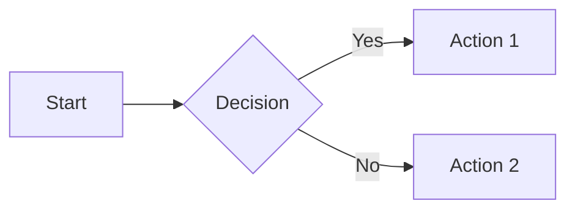

# MkDocs Documentation

This directory contains the documentation for DevPulse, built with [MkDocs](https://www.mkdocs.org/) and [Material for MkDocs](https://squidfunk.github.io/mkdocs-material/).

## 🚀 Quick Start

### Install Dependencies

```bash
pip install -r requirements-docs.txt
```

### Serve Documentation Locally

```bash
mkdocs serve
```

Then open your browser to http://127.0.0.1:8000

### Build Static Site

```bash
mkdocs build
```

The static site will be generated in the `site/` directory.

## 📁 Documentation Structure

```
docs/
├── index.md                 # Homepage (auto-generated from README)
├── QUICKSTART.md           # Quick start guide
├── USAGE.md                # CLI usage guide
├── GUI-GUIDE.md            # GUI user guide
├── GUI-SCREENSHOTS.md      # GUI screenshots
├── ARCHITECTURE.md         # Technical architecture
├── DEVELOPMENT.md          # Development guide
├── PROJECT-STRUCTURE.md    # Project structure
├── PROJECT-SUMMARY.md      # Project summary
├── CHALLENGE.md            # GitHub Copilot Challenge
├── stylesheets/
│   └── extra.css           # Custom CSS
└── javascripts/
    ├── extra.js            # Custom JavaScript
    └── mathjax.js          # MathJax configuration
```

## 🎨 Customization

### Theme Colors

The theme uses Indigo as the primary and accent colors. You can customize these in `mkdocs.yml`:

```yaml
theme:
  palette:
    primary: indigo
    accent: indigo
```

### Navigation

The navigation structure is defined in `mkdocs.yml` under the `nav` section. Update it to reflect changes in documentation structure.

### Custom CSS/JS

- Add custom styles to `docs/stylesheets/extra.css`
- Add custom JavaScript to `docs/javascripts/extra.js`

## 📝 Writing Documentation

### Markdown Extensions

This documentation supports:

- ✅ Admonitions (notes, warnings, tips)
- ✅ Code highlighting with syntax
- ✅ Tabbed content
- ✅ Task lists
- ✅ Mermaid diagrams
- ✅ Emoji :smile:
- ✅ Math equations (KaTeX/MathJax)

### Example Admonition

```markdown
!!! note "Important Note"
    This is an important note that users should read.

!!! warning "Warning"
    This is a warning message.

!!! tip "Pro Tip"
    This is a helpful tip.
```

### Example Tabs

```markdown
=== "Python"
    ```python
    print("Hello, World!")
    ```

=== "JavaScript"
    ```javascript
    console.log("Hello, World!");
    ```
```

### Example Mermaid Diagram

```markdown

```

## 🚢 Deployment

### GitHub Pages

```bash
# Build and deploy to gh-pages branch
mkdocs gh-deploy
```

### Versioning with Mike

```bash
# Deploy a new version
mike deploy 1.0 latest --update-aliases

# Set default version
mike set-default latest

# Deploy to GitHub Pages
mike deploy --push 1.0 latest
```

### Manual Deployment

1. Build the site: `mkdocs build`
2. Upload the `site/` directory to your web server

## 🔧 Configuration

The main configuration is in `mkdocs.yml` at the project root. Key sections:

- **site_name**: The name displayed in the header
- **theme**: Theme configuration (Material for MkDocs)
- **nav**: Navigation structure
- **plugins**: Enabled plugins
- **markdown_extensions**: Enabled Markdown extensions
- **extra**: Additional configuration (social links, analytics)

## 📚 Resources

- [MkDocs Documentation](https://www.mkdocs.org/)
- [Material for MkDocs Documentation](https://squidfunk.github.io/mkdocs-material/)
- [PyMdown Extensions](https://facelessuser.github.io/pymdown-extensions/)
- [Mermaid Documentation](https://mermaid-js.github.io/mermaid/)

## 🤝 Contributing

When adding new documentation:

1. Create a new `.md` file in the `docs/` directory
2. Add the file to `mkdocs.yml` navigation
3. Use appropriate Markdown extensions for formatting
4. Test locally with `mkdocs serve`
5. Submit a pull request

## 📄 License

Documentation is licensed under MIT License, same as the project.
